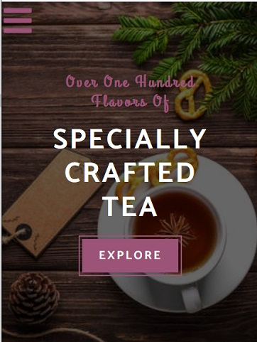
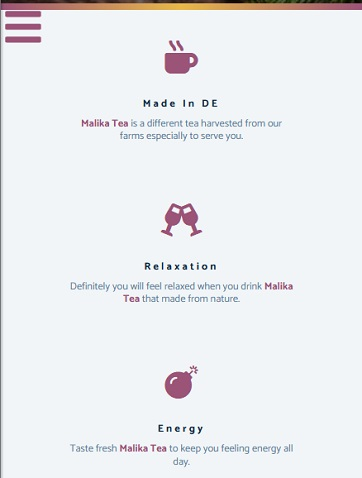
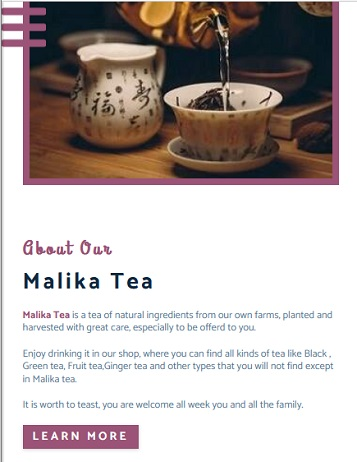
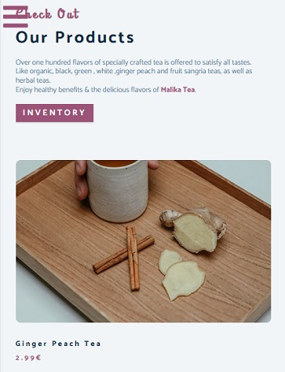
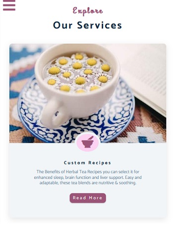
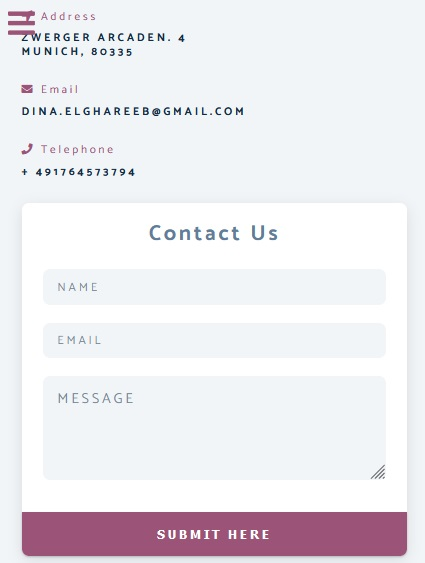

# html-css-malika-tea
Simple web application for Malika Tea 🍵
- Responsive Design. 
- Navbar.
- Columns Layouts using Floats. 
- External Icons from fontawesome.  
- Animation. 

To run Demo : https://malika-tea.netlify.app/

## Screenshots 🎉

<table >
 <tr>
  <td></td>
  <td></td>
  <td></td>
 </tr>
 <tr>
  <td></td>
  <td></td>
  <td></td>
 </tr>
</table>